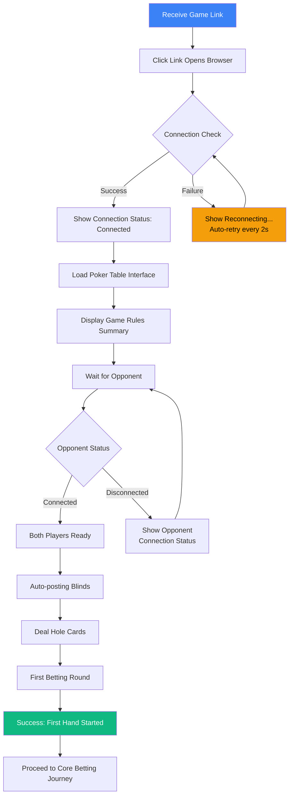
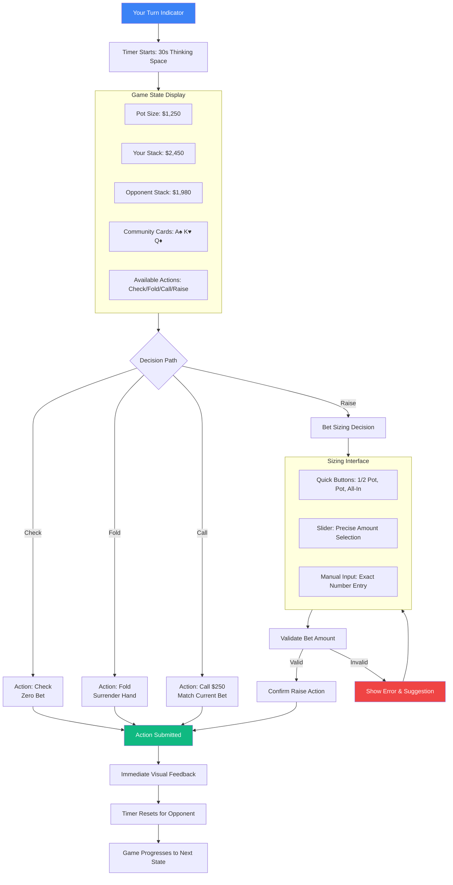
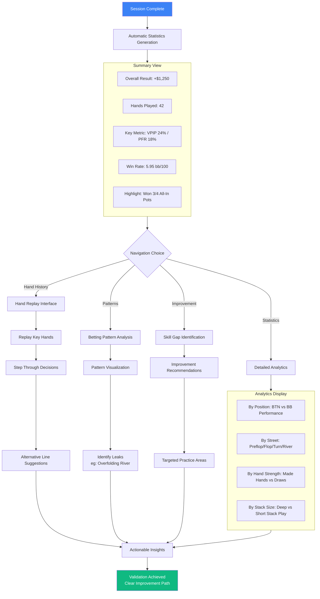

# UX Design Specification turnbasedgame

**Author:** Riddler
**Date:** Tue Dec 09 2025

---

<!-- UX design content will be appended sequentially through collaborative workflow steps -->

## Executive Summary

### Project Vision

Create a minimalist, high-performance heads-up No Limit Texas Hold'em poker platform that does "one thing exceptionally well": provides a technically excellent poker experience where only skill determines outcomes. By combining C++ server reliability with browser accessibility, we eliminate technical variables that frustrate serious players seeking validation of their poker skills.

### Target Users

**Peter - The Challenger Seeking Validation**
- Seeks objective proof of poker skill after years of study
- Frustrated by inconclusive live game results due to distractions
- Values reliable gameplay that validates strategic decisions
- Wants clear, undeniable data showing skill superiority

**John - The Defender Protecting His Reputation**  
- Competitive pride drives need to establish objective truth
- Wants fair, consistent rules without technical excuses
- Seeks improvement roadmap through honest performance data
- Values system that gives space for serious decision-making

Both users are tech-savvy friends who want to settle poker debates in a distraction-free environment that treats their competition seriously.

### Key Design Challenges

1. **Clarity in Complex State** - Poker has inherently complex game state (4 betting rounds, hole/community cards, chip stacks, pot calculations, side pots). The interface must make this instantly understandable without overwhelming users during critical decisions.

2. **Confidence Through Visible Reliability** - Core value is "technical excellence eliminates variables." The design must visibly demonstrate reliability during disconnections, timeouts, and reconnections to build user trust during high-stakes moments.

3. **Familiarity vs Minimalism Balance** - Users expect standard poker interfaces, but the vision demands "one thing exceptionally well" with minimal distractions. We must balance familiar poker table metaphors with clean, focused design.

4. **Emotional State Management** - Poker is emotionally charged (validation, reputation, competition). The interface must support high-stakes decisions (all-ins, river calls) without adding interface anxiety or pressure.

### Design Opportunities

1. **The "No-Distractions Poker Lab"** - Create a focused environment where nothing distracts from poker skill analysis. Remove all non-essential elements to serve the "two friends settling a debate" use case uniquely well.

2. **Reliability as a Visible Feature** - Instead of hiding technical excellence, make it a design feature. Show connection status, game state preservation, and reconnection progress in ways that build confidence during critical gameplay moments.

3. **Validation Through Data Visualization** - Design statistics and history visualization that clearly shows who's winning, why, and what patterns emerge. Make the "proof" of skill visual and undeniable for both validation seekers and reputation defenders.

4. **Time as Thinking Space** - Design the action timer not as pressure but as protected "thinking space." Create a calm interface during decision time that reduces anxiety about technical timeouts and supports serious strategic thought.

## Core User Experience

### Defining Experience

The core user experience centers on **strategic decision-making during betting rounds**, where poker skill validation happens. Users most frequently make bet/fold/raise/call/check decisions, with the betting interface being the critical interaction to perfect. The experience must make complex poker state instantly understandable while providing the cognitive space for serious strategic thought.

**Core User Actions:**
- **Primary**: Making betting decisions with clear understanding of pot odds and stack sizes
- **Critical**: Accurate bet placement and amount selection during high-stakes moments
- **Effortless**: Understanding game state (whose turn, available actions, pot size) at a glance
- **Foundational**: Reconnecting after network issues with complete state preservation

### Platform Strategy

**Primary Platform**: Desktop web browsers with mouse/keyboard input for precision betting controls
**Secondary Support**: Tablet browsers with touch-optimized betting interfaces
**Key Requirements**: 
- Ample screen real estate for poker table visualization (minimum 1024x768 recommended)
- Real-time WebSocket communication for <200ms action synchronization
- Persistent connection status display visible at all times
- No installation or account creation required - direct browser access

**Input Optimization**: 
- Mouse/keyboard for precise bet amount selection and action buttons
- Touch support for tablet users with larger betting controls
- Keyboard shortcuts for power users (fold, check, call with single keys)

### Effortless Interactions

**Automated for Zero Thought:**
- Pot calculation and side pot determination during all-in situations
- Chip stack tracking and bet amount validation against remaining stack
- Hand ranking determination at showdown
- Blind posting and automatic action progression
- Connection recovery with preserved game state

**Eliminated Friction Points:**
- No account creation or login process
- No deposits or real money transactions
- Direct game access via shared link
- Automatic rebuy option after busting
- Instant table join without waiting lists

**Delight Through Simplicity:**
- One-click bet sizing with visual stack/pot ratio indicators
- Clear visual distinction between hole cards and community cards
- Intuitive chip drag-and-drop or button-based betting
- Instant hand history access without menu navigation

### Critical Success Moments

**"This is Better" Realization:**
- Reconnecting after internet flicker to find game exactly as paused
- Seeing clean, focused interface without casino distractions during first all-in decision
- Having full 30-second timer actually feel like thinking space, not pressure

**User Accomplishment Moments:**
- Successfully bluffing and seeing opponent's thought process in timing data
- Identifying personal leaks through clear post-session statistics
- Having skill validated by undeniable win/loss data over multiple sessions
- Making perfect bet sizing decision supported by clear pot odds display

**Make-or-Break Interactions:**
- Betting interface during all-in decisions (must be flawless)
- Connection loss handling during critical hands (must preserve state perfectly)
- Timer display during river decisions (must reduce anxiety, not increase it)
- First-time user success in placing initial bet and completing first hand

**First-Time Success Flow:**
1. Click shared game link
2. See clear poker table with connection status
3. Understand available betting controls immediately
4. Successfully complete first betting round within 60 seconds

### Experience Principles

1. **Trust Through Transparency** - Make technical reliability visible through clear connection status, state preservation indicators, and reconnection progress. Users should never doubt system fairness during critical moments.

2. **Clarity Over Clutter** - Present complex poker state (4 betting rounds, hole/community cards, chip stacks, multiple pots) with visual hierarchy that supports, not overwhelms, strategic decision-making.

3. **Time as a Feature** - Design action timers as protected thinking space, not pressure. Reduce anxiety about technical constraints and support serious strategic analysis during high-stakes decisions.

4. **Validation by Design** - Build skill validation into the interface through clear statistics, performance data visualization, and undeniable evidence of patterns that answer "Who's better and why?"

## Desired Emotional Response

### Primary Emotional Goals

**Core Emotional State: Calm Confidence Under Pressure**
Users should feel **focused and in control** during betting decisions, **trusting of the system** during technical moments, and **validated or motivated** by outcomes regardless of win/loss. The experience should feel like a "no-distractions poker lab" where emotions come from skill competition, not technical anxiety.

**Primary Emotions:**
- **Confidence**: In understanding game state and available actions
- **Trust**: In system fairness and reliability during critical moments
- **Calm Focus**: During high-pressure decisions (all-ins, river calls)
- **Validation/Motivation**: From clear performance data proving skill or identifying improvements

**Differentiating Feeling**: "Serious competition without technical anxiety" - unlike casino-style poker sites that feel flashy and gambling-focused.

### Emotional Journey Mapping

**Discovery Phase → Hopeful Skepticism**
- Initial feeling: "This looks simple and focused - maybe it will actually work"
- Emotional goal: Cautious optimism that this might solve their frustration with inconclusive live games

**Core Experience → Calm Strategic Focus**
- During betting decisions: "I have time to think, the interface stays out of my way"
- During all-in moments: "The system will handle whatever happens technically"
- During disconnection/reconnection: "It paused exactly where we were - I trust this"
- Emotional state: Deep focus on poker strategy without interface distraction

**Task Completion → Satisfied Learning**
- After winning session: "My skill was validated by undeniable data"
- After losing session: "I see exactly where to improve - this is valuable feedback"
- After identifying leaks: "Now I know what to work on - motivated to improve"
- Emotional outcome: Satisfaction from meaningful competition, not just win/loss results

**Return Engagement → Confident Anticipation**
- Before next session: "Excited to continue our competition with reliable data"
- During reconnection: "Confident the system preserved everything perfectly"
- Emotional continuity: Trust built through consistent reliability creates ongoing confidence

### Micro-Emotions

**Maximize:**
- **Confidence** over confusion in game state understanding
- **Trust** over skepticism in system fairness and reliability
- **Calm** over anxiety during timer counts and technical moments
- **Accomplishment** over frustration from clear skill validation
- **Satisfaction** from meaningful competition regardless of outcome

**Minimize:**
- **Confusion** about whose turn, available actions, or pot amounts
- **Skepticism** about system fairness during all-ins or disconnections
- **Anxiety** about technical timeouts or connection issues
- **Frustration** from unclear betting controls or interface complexity
- **Isolation** - maintain feeling of shared competition between friends

### Design Implications

**Trust → Visible Reliability Design**
- Persistent connection status indicator (always visible)
- State preservation feedback during reconnection ("Game paused at turn 3, river card pending")
- Transparent error handling with clear recovery options
- Visual confirmation of bets placed and actions registered

**Calm Under Pressure → Interface Serenity**
- Timer display as "thinking space" not countdown pressure (gentle pulsing vs. red flashing)
- Clean interface during critical decisions (minimal distractions, focused information hierarchy)
- Consistent visual language that doesn't escalate emotional tension
- Predictable interaction patterns that reduce cognitive load

**Validation → Data Transparency**
- Clear win/loss statistics with undeniable visual evidence
- Pattern recognition in betting behavior and decision timing
- Improvement roadmap visualization based on session data
- Side-by-side performance comparison that answers "Who's better and why?"

**Confidence → Instant State Clarity**
- At-a-glance understanding of game phase, active player, available actions
- Intuitive betting controls with clear affordances
- Visual distinction between hole cards (private) and community cards (shared)
- Obvious pot calculation and stack size relationships

### Emotional Design Principles

1. **Trust Through Transparency** - Never hide technical state; make reliability a visible feature that builds confidence during critical moments.

2. **Calm Through Predictability** - Design interactions that feel natural and predictable, reducing anxiety about interface complexity during high-stakes decisions.

3. **Validation Through Clarity** - Present performance data with undeniable visual clarity that provides meaningful feedback regardless of win/loss outcomes.

4. **Focus Through Minimalism** - Remove all non-essential elements that could distract from strategic thinking during betting decisions.

5. **Confidence Through Instant Understanding** - Design game state to be comprehensible in under 3 seconds, eliminating confusion that undermines user confidence.

## UX Pattern Analysis & Inspiration

### Inspiring Products Analysis

**GGPoker - Excellence in Poker Interface Design**
- **Game State Clarity**: Strong visual hierarchy with pot prominently centered, community cards clearly displayed below, player positions intuitively arranged around virtual table. Active player highlighting uses subtle glow effects without distraction.
- **Betting Controls**: Combination of slider for precise amounts and quick buttons (1/2 pot, pot, all-in) for common bet sizing. Action buttons (Check/Fold/Call/Raise) positioned consistently with clear visual distinction.
- **Card Presentation**: Distinct visual treatment for hole cards (private, angled display) vs community cards (shared, centered display). Subtle dealing animations that don't disrupt gameplay flow.
- **Stack Visualization**: Chip stacks represented as proportional columns with clear numeric values. Visual connection between player stacks and pot through spatial relationship.

**Chess Apps (chess.com, Lichess) - Turn-Based Strategy Excellence**
- **Board Clarity**: Clean, uncluttered board with clear piece distinction. Consistent color scheme that reduces visual fatigue during extended sessions.
- **Move History**: Chronological move list with ability to replay and analyze decisions, supporting post-game learning and validation.
- **Clock Management**: Timer display integrated into player position without dominating visual attention. Gentle warnings vs aggressive countdown pressure.
- **Evaluation Tools**: Computer analysis presented as subtle evaluation bar, providing insight without overwhelming beginner players.

**Trading Platforms (TradingView, Thinkorswim) - High-Stakes Decision Support**
- **Data Visualization**: Clean charts with essential information hierarchy. Multiple timeframes available without interface clutter.
- **Order Entry**: Precise controls for trade sizing with risk calculation. Quick order types (market, limit, stop) with clear visual feedback.
- **Risk Management**: Position sizing tools and risk indicators integrated into order flow. Clear P&L display without emotional color coding (red/green bias).

### Transferable UX Patterns

**Navigation & Layout Patterns:**
- **Central Focus Layout** (from GGPoker) - Critical information (pot, community cards) centered with player positions orbiting around. Perfect for heads-up poker table visualization.
- **Progressive Disclosure** (from trading platforms) - Advanced controls (custom bet sizing, statistics) available but hidden by default, reducing initial complexity.
- **Consistent Action Placement** (from all examples) - Primary actions (betting controls, order entry) consistently positioned and sized for muscle memory development.

**Interaction Patterns:**
- **Precision + Speed Balance** (from GGPoker & trading) - Slider for precise amounts + quick buttons for common actions. Supports both deliberate strategy and fast-paced play.
- **Undo/Redo Visualization** (from chess apps) - Move history with replay capability for post-game analysis and learning.
- **Risk Visualization** (from trading) - Clear display of bet size relative to stack and pot, supporting calculated decision-making.

**Visual Patterns:**
- **Hierarchical Color Coding** (from chess & trading) - Reserved, intentional color use (active player, available actions) rather than decorative coloring.
- **Proportional Representation** (from GGPoker) - Chip stack size visually proportional to actual amount, supporting quick estimation.
- **Subtle State Indicators** (from all examples) - Gentle highlights, borders, or positioning rather than flashy animations for state changes.

### Anti-Patterns to Avoid

**From Mainstream Poker Sites:**
1. **Casino Visual Overload** - Flashy animations during betting, decorative themes, sound effects that create "gambling" atmosphere rather than "skill competition" environment.
2. **Promotional Interruptions** - Pop-ups for deposits, tournaments, or promotions that break concentration during critical gameplay moments.
3. **Social Feature Distraction** - Chat windows, friend requests, avatar customization that distract from focused heads-up competition.
4. **Multi-Table Complexity** - Interface elements designed for multi-tabling (table minimizer, lobby integration) that add clutter for single-table heads-up play.
5. **Emotional Color Coding** - Aggressive red/green for wins/losses that creates emotional bias rather than analytical mindset.

**General UX Anti-Patterns:**
- **Hidden Game State** - Critical information (pot size, active player) not immediately visible or requires hunting.
- **Inconsistent Controls** - Betting actions that move or change based on game state, breaking muscle memory.
- **Timer Anxiety** - Aggressive countdowns, flashing warnings, or loud alerts that increase pressure rather than support thinking.
- **Overwhelming Statistics** - Performance data presented as dense tables or complex charts without clear takeaways.

### Design Inspiration Strategy

**What to Adopt:**
1. **GGPoker's Layout Hierarchy** - Central pot/community cards with orbiting player positions, providing instant game state understanding.
2. **Chess App's Analysis Tools** - Move replay and basic statistics for post-game learning and skill validation.
3. **Trading Platform's Risk Visualization** - Clear bet size relative to stack and pot, supporting calculated decision-making.

**What to Adapt:**
1. **GGPoker's Betting Controls** - Simplify by removing casino-style animations while keeping precision slider + quick buttons.
2. **Chess Clock Display** - Modify timer to feel like "thinking space" rather than pressure countdown.
3. **Trading Risk Indicators** - Adapt for poker context (bet size as percentage of stack/pot) with cleaner visual presentation.

**What to Avoid:**
1. **Casino Aesthetics** - Strip all decorative elements, flashy animations, and sound effects that don't serve gameplay clarity.
2. **Social Distractions** - Remove chat, avatars, and friend systems that could interrupt focused competition.
3. **Promotional Elements** - Eliminate any upsell, deposit, or promotional messaging within the gameplay interface.
4. **Multi-Table Features** - Exclude interface elements designed for multi-tabling since we're heads-up only.

**Strategy Summary**: Create a "GGPoker meets chess.com" experience - the game state clarity and betting precision of professional poker interfaces combined with the focused, analytical environment of serious chess platforms, all stripped of casino distractions.

## Design System Foundation

### 1.1 Design System Choice

**Selected Approach: Tailwind UI with Headless Components**

**Core Stack:**
- **Tailwind CSS** - Utility-first CSS framework for complete visual control
- **Headless UI / Radix Primitives** - Unstyled interactive components for behavior without imposed visuals
- **Custom Component Library** - Poker-specific components built with Tailwind styling

**Alternative Considered & Rejected:**
- **Material Design / Ant Design**: Too corporate/business-focused, conflicts with gaming interface needs
- **Pure Custom CSS**: Higher maintenance burden for solo developer
- **Bootstrap / Other opinionated frameworks**: Too restrictive for specialized poker components

### Rationale for Selection

**Why Tailwind + Headless Components:**

1. **Complete Visual Sovereignty** - Essential for creating the unique "no-distractions poker lab" aesthetic that must completely avoid casino styling. Utility classes provide pixel-perfect control without fighting framework defaults.

2. **Specialized Poker Component Support** - Headless components provide interactive behaviors (sliders, dialogs, toggles) without visual styling, allowing custom poker components (chip stacks, card displays, betting controls) to be built with Tailwind's utility classes.

3. **Solo Developer Efficiency** - Tailwind reduces context switching between HTML/CSS files. Consistent design tokens (spacing, colors, typography) defined in config file ensure visual consistency without manual synchronization.

4. **Performance Alignment** - Utility-first CSS generates minimal CSS output (<10KB typical), important for real-time poker interface requiring efficient rendering during fast gameplay with <200ms latency requirements.

5. **Maintenance Sustainability** - Design system defined in single configuration file (tailwind.config.js) makes visual updates systematic and manageable for solo long-term maintenance.

6. **Customization Without Bloat** - Unlike pre-styled component libraries, Tailwind + headless allows building exactly what poker needs without unused casino-style components or fighting against business-focused design assumptions.

### Implementation Approach

**Phase 1: Foundation Setup**
1. Configure Tailwind with custom design tokens (colors, spacing, typography, animations)
2. Establish base layer styles for poker-specific needs (card dimensions, chip sizes, table layout)
3. Set up headless component integration with custom Tailwind styling

**Phase 2: Core Poker Components**
1. **Card Components**: Hole cards (private) vs community cards (shared) with distinct styling
2. **Chip Stack Components**: Visual representation proportional to stack size with clear numeric values
3. **Betting Controls**: Slider for precise amounts + quick buttons (1/2 pot, pot, all-in) with custom styling
4. **Action Buttons**: Check/Fold/Call/Raise with consistent positioning and clear visual states

**Phase 3: Game State Components**
1. **Pot Display**: Central pot visualization with clear chip count and side pot indicators
2. **Player Position Components**: Visual distinction for active player, stack sizes, betting status
3. **Timer Display**: "Thinking space" timer integrated into player position without pressure design
4. **Connection Status**: Persistent indicator with clear states (connected, reconnecting, disconnected)

**Phase 4: Advanced Components**
1. **Statistics Visualization**: Clean charts and data displays for post-game analysis
2. **Hand History**: Move replay interface with Tailwind-styled timeline
3. **Settings/Configuration**: Minimal interface for game options and preferences

### Customization Strategy

**Design Tokens (tailwind.config.js):**
```javascript
// Poker-specific color palette (not casino colors)
colors: {
  background: {
    table: '#1a2937', // Dark slate for contrast
    card: '#ffffff',
    interface: '#2d3748',
  },
  poker: {
    heart: '#dc2626', // Red for hearts
    diamond: '#dc2626', // Red for diamonds  
    club: '#1f2937',   // Dark for clubs
    spade: '#1f2937',  // Dark for spades
    chip: { /* gradient-based chip colors */ }
  },
  state: {
    active: '#3b82f6', // Calm blue for active player
    connected: '#10b981', // Green for connection
    disconnected: '#ef4444', // Red for issues
    timer: '#f59e0b', // Amber for thinking time
  }
}
```

**Component Customization Principles:**
1. **No Casino Visuals** - Strip all decorative elements, gradients, shadows that don't serve gameplay clarity
2. **Calm Color Palette** - Use reserved, analytical colors rather than emotional red/green for wins/losses
3. **Consistent Spacing** - Poker table proportions dictate spacing (card dimensions, chip stack heights)
4. **Accessible Contrast** - Ensure all game state information meets WCAG AA standards for color contrast
5. **Performance First** - Optimize animations for 60fps, prioritize critical game state rendering

**Build Process:**
- Component development in isolation with Tailwind's JIT compiler
- Design token validation against poker use cases (card readability, chip visibility)
- Accessibility testing for color blindness and contrast requirements
- Performance profiling for real-time update scenarios

## 2. Core User Experience

### 2.1 Defining Experience

**Core Defining Interaction**: "Making strategic betting decisions with complete confidence that technical variables won't interfere with skill validation."

**Experience Description**: Users engage in heads-up No Limit Texas Hold'em where the interface provides crystal-clear game state understanding, precise betting controls, and visible technical reliability - creating a focused environment where poker skill is the only variable that matters. The experience combines the strategic depth of chess with the precision of trading platforms, all within the familiar framework of professional poker interfaces.

**Key Characteristics**:
- **Strategic Clarity**: Complex poker state (4 betting rounds, hole/community cards, chip stacks, pots) understandable in under 3 seconds
- **Betting Precision**: Controls that feel deliberate and accurate, supporting calculated risk-taking
- **Technical Transparency**: Reliability visible through connection status, state preservation, and seamless recovery
- **Validation Focus**: Interface designed to prove skill through data, not entertain through casino aesthetics

### 2.2 User Mental Model

**Current Problem-Solving Approach**:
Peter and John currently use mainstream poker sites (like GGPoker) but tolerate casino distractions that interfere with serious competition. They bring expectations from professional poker interfaces: central pot display, orbiting player positions, standard betting controls, and card presentation.

**Frustrations with Existing Solutions**:
- Casino aesthetics (flashy animations, decorative themes) that create "gambling" atmosphere
- Promotional interruptions during critical gameplay moments
- Social features (chat, avatars) that distract from focused competition
- Unclear statistics that don't provide meaningful skill validation

**Expectations for Our Solution**:
- Familiar poker interface patterns (GGPoker's game state clarity and betting controls)
- Technical reliability that matches or exceeds mainstream platforms
- Clean, focused environment without casino distractions
- Clear data proving skill superiority or identifying improvement areas

**Potential Confusion Points**:
- If we strip away too much casino familiarity, interface might feel unfamiliar
- Novel "thinking space" timer design might need subtle onboarding
- Minimalist statistics presentation might feel sparse compared to data-heavy alternatives

### 2.3 Success Criteria

**User Experience Success Indicators**:
1. **Game State Comprehension** - Users can understand active player, available actions, pot size, and stack relationships in under 3 seconds
2. **Betting Precision** - Bet placement feels deliberate and accurate, with clear visual feedback confirming actions
3. **Technical Confidence** - Users never worry about connection issues during critical decisions; reconnection feels seamless and trustworthy
4. **Skill Validation** - Post-session statistics provide clear, undeniable evidence of skill patterns and improvement areas
5. **Interface Transparency** - UI stays out of the way during high-stakes moments, supporting rather than distracting from strategic thought

**Performance Success Criteria**:
- Bet actions complete within 200ms from input to visual confirmation
- Game state updates appear within 300ms of server decisions
- Interface renders within 3 seconds on modern browsers
- Reconnection succeeds within 5 seconds for transient network issues
- Statistics load immediately after session completion

**Emotional Success Criteria**:
- Users feel **calm** during timer counts, not anxious
- Users feel **confident** in system fairness during all-in decisions
- Users feel **validated** by data regardless of win/loss outcomes
- Users feel **focused** on poker strategy without interface distraction

### 2.4 Novel UX Patterns

**Established Patterns We're Using**:
1. **GGPoker's Layout Hierarchy** - Central pot with orbiting player positions for instant game state understanding
2. **Professional Betting Controls** - Slider for precision + quick buttons (1/2 pot, pot, all-in) for speed
3. **Standard Card Presentation** - Distinct visual treatment for hole cards (private) vs community cards (shared)
4. **Poker Table Metaphor** - Virtual table with standard player positioning and chip stack visualization

**Novel Patterns We're Introducing**:
1. **"Thinking Space" Timer Design** - Action timer as protected decision time rather than pressure countdown
2. **Visible Reliability Indicators** - Connection status and state preservation as primary interface elements
3. **Lab Aesthetic Over Casino** - Scientific, analytical visual language replacing decorative casino styling
4. **Validation-First Statistics** - Data visualization designed to answer "Who's better and why?" not just track wins/losses

**Pattern Innovation Strategy**:
- **Keep functional patterns familiar** (betting, card display, table layout) so users don't need to learn new poker
- **Innovate on emotional/aesthetic layer** to create "poker lab" feeling distinct from casino environment
- **Progressive disclosure** - Advanced features (statistics, hand replay) available but not overwhelming
- **Consistent interaction language** across novel and established patterns for cohesive experience

### 2.5 Experience Mechanics

**Core Experience Flow: Strategic Betting Decision**

**1. Initiation:**
- Game state clearly indicates it's user's turn (subtle player highlight, position indicator)
- Available actions (Check/Fold/Call/Raise) presented with clear affordances
- Pot size and opponent stack prominently displayed for risk calculation
- Timer begins gentle pulsing to indicate "thinking space" availability

**2. Interaction:**
- **Bet Sizing**: Slider for precise amounts with visual stack/pot ratio indicators OR quick buttons for common bet sizes
- **Action Selection**: Check/Fold/Call/Raise buttons with consistent positioning and clear visual states
- **Risk Assessment**: Bet amount visually connected to pot and stack sizes for immediate understanding
- **Confirmation**: Clear visual feedback (color change, animation) confirms action before submission

**3. Feedback:**
- **Immediate**: Action button visual confirmation, bet amount display updates
- **Progressive**: Timer resets for opponent, game state transitions smoothly
- **Technical**: Connection status remains visible, no interface lag or hesitation
- **Emotional**: Interface maintains calm, focused aesthetic during high-pressure moments

**4. Completion:**
- **Successful Outcome**: Action registered with server, game progresses to next state
- **User Certainty**: Clear visual indication that decision is complete and irreversible
- **Next Step**: Turn passes to opponent with clear visual transition
- **Learning Opportunity**: Action added to move history for post-game analysis

**Error States & Recovery:**
- **Betting Error**: Clear error message with specific correction guidance (e.g., "Minimum raise is $X")
- **Connection Loss**: Game pauses with clear "Reconnecting..." status, preserved state visible
- **Timer Expiration**: Gentle fold with clear indication, option to review in hand history
- **Interface Confusion**: Consistent help access without disrupting gameplay flow

## Visual Design Foundation

### Color System

**Primary Color Palette (Dark Mode Focus):**
- **Background**: `#0f172a` (dark slate) - Reduces eye strain, creates focused environment for extended sessions
- **Surface**: `#1e293b` (medium slate) - Card/component backgrounds with clear visual separation
- **Text Primary**: `#f1f5f9` (light gray) - Maximum contrast for readability (WCAG AA compliant)
- **Text Secondary**: `#94a3b8` (medium gray) - Supporting information, labels

**Accent Colors:**
- **Primary Accent**: `#3b82f6` (calm blue) - Active player indicator, connection status, primary actions
- **Secondary Accent**: `#10b981` (success green) - Connected state, positive outcomes, valid actions
- **Warning**: `#f59e0b` (amber) - Timer display, "thinking space" indicator
- **Error**: `#ef4444` (red) - Disconnection states, betting errors, critical issues

**Poker-Specific Colors:**
- **Hearts/Diamonds**: `#dc2626` (consistent red) - Clear suit distinction with color-blind friendly shapes
- **Clubs/Spades**: `#1f2937` (dark gray) - Clear suit distinction with color-blind friendly shapes
- **Chip Gradients**: Value-based gradients (blue→green→gold) proportional to chip denominations

**Accessibility Compliance:**
- All text meets WCAG AA contrast ratios (minimum 4.5:1)
- Color not used as sole indicator of state (supplemented with icons/text)
- Sufficient size for interactive elements (minimum 44×44px touch targets)
- Dark mode reduces blue light emission for extended poker sessions

### Typography System

**Primary Typeface - System Font Stack:**
```
font-family: Inter, -apple-system, BlinkMacSystemFont, 'Segoe UI', Roboto, Oxygen, Ubuntu, sans-serif;
```
- **Rationale**: Optimal readability across platforms, no font loading performance penalty, familiar user experience
- **Characteristics**: Clean, modern aesthetic with excellent readability at small sizes for poker labels and controls

**Monospace for Data - JetBrains Mono:**
```
font-family: 'JetBrains Mono', 'SF Mono', Monaco, 'Cascadia Mono', monospace;
```
- **Rationale**: Clear number distinction (0 vs O, 1 vs l), technical/data-focused aesthetic for chip counts and statistics
- **Usage**: Chip amounts, bet sizes, timer display, post-session statistics, hand history

**Type Scale (Tailwind-based Hierarchy):**
- **H1**: `text-4xl` (36px) - Main application headings, session titles
- **H2**: `text-2xl` (24px) - Section headings (statistics, player info)
- **H3**: `text-xl` (20px) - Subsection headings, important labels
- **Body**: `text-base` (16px) - Primary content, button labels (WCAG minimum)
- **Small**: `text-sm` (14px) - Supporting text, chip values, secondary information
- **Extra Small**: `text-xs` (12px) - Fine print, detailed statistics, timestamps

**Line Heights & Spacing:**
- **Body Text**: `leading-relaxed` (1.625) - Comfortable reading density for statistics and analysis
- **Headings**: `leading-tight` (1.25) - Compact visual hierarchy for interface labels
- **Monospace Data**: `leading-normal` (1.5) - Clear character separation for numeric displays
- **Card Text**: `leading-none` (1) - Tight spacing for card rank/suit combinations

### Spacing & Layout Foundation

**Base Unit**: 4px (Tailwind default)
- **Rationale**: Fine-grained control over poker-specific proportions, aligns with chosen design system (Tailwind), allows precise component sizing

**Spacing Scale** (4px multiples):
- `1` = 4px (micro spacing between related elements)
- `2` = 8px (element padding, chip separation)
- `3` = 12px (section spacing, card groupings)
- `4` = 16px (component spacing, player position separation)
- `6` = 24px (major section separation, table edges)
- `8` = 32px (layout blocks, statistics panels)

**Poker-Specific Proportions:**
- **Card Dimensions**: 60px × 90px (standard 2.5" × 3.5" playing card ratio)
- **Chip Size**: 40px diameter (clear visibility, adequate touch target)
- **Table Radius**: 12px (soft corners for modern aesthetic, distinct from sharp casino tables)
- **Element Separation**: 16px between related game elements (hole cards, community cards, chip stacks)

**Grid System:**
- **Primary Layout**: Flexbox for responsive poker table arrangement
- **Component Grid**: CSS Grid for statistics displays and complex data visualizations
- **Breakpoints**: Tailwind defaults (sm:640px, md:768px, lg:1024px, xl:1280px)
- **Responsive Strategy**: Desktop-optimized with tablet fallbacks (simplified controls for touch)

**Layout Principles:**
1. **Central Focus Architecture** - Critical game information (pot, community cards) centered with maximum visibility and hierarchical importance
2. **Orbital Player Hierarchy** - Player positions arranged around central focus with clear spatial relationships and consistent spacing
3. **Progressive Information Density** - Gameplay view (dense, information-rich) vs statistics view (spacious, analytical) with smooth transitions
4. **Consistent Visual Rhythm** - Repeated spacing patterns create visual harmony and reduce cognitive load during extended sessions

### Accessibility Considerations

**Color & Contrast:**
- All interactive elements maintain 3:1 contrast ratio against background
- Color-blind friendly suit differentiation (shape indicators + color)
- Reduced saturation for extended viewing comfort
- Consistent color semantics across game states

**Typography & Readability:**
- Minimum 16px body text (exceeds WCAG AA requirements)
- Line length limited to 70-80 characters for statistics and analysis displays
- Adequate letter spacing in monospace fonts for clear number distinction
- Responsive text scaling for different viewing distances

**Interactive Elements:**
- Minimum 44×44px touch targets for all betting controls and action buttons
- Clear :focus states for keyboard navigation support
- Sufficient spacing between interactive elements to prevent accidental activation
- Visual feedback for all interactions (color change, subtle animation)

**Motion & Animation:**
- Respects reduced motion preferences via `prefers-reduced-motion` media query
- Essential animations only (card dealing, chip movement, state transitions)
- Animation duration < 300ms to maintain real-time gameplay feel
- Smooth easing curves (cubic-bezier) for natural motion perception

## Design Direction Decision

### Design Directions Explored

Eight distinct design directions were generated and explored in the interactive HTML showcase (`docs/ux-design-directions.html`):

1. **Minimalist Analytical** - Extreme visual simplicity, monochromatic with single accent color, maximum information hierarchy
2. **Data-Centric** - Analytical focus with data visualization integrated into gameplay, real-time statistics overlay
3. **Traditional Poker (Lab Version)** - Familiar poker table aesthetics refined for "lab" environment, professional felt textures
4. **Command Center** - Dashboard-style interface with multiple information panels, configurable layouts
5. **Zen Focus** - Calm, spacious design with generous whitespace, reduced visual density for stress-free play
6. **Progressive Disclosure** - Clean base interface with advanced controls revealed contextually, adaptive complexity
7. **Modular Grid** - Structured grid-based layout with consistent spacing, component-based design system
8. **Fluid Organic** - Dynamic, flowing layouts with natural curves, adaptive to content and screen space

### Chosen Direction

**Primary Direction: Minimalist Analytical** with integrated elements from **Data-Centric** and **Zen Focus**.

**Core Visual Approach:**
- **Minimalist Analytical** as foundation for extreme focus and reduced cognitive load
- **Data-Centric** elements for integrated statistics visualization during gameplay
- **Zen Focus** principles for calm, spacious feeling during high-pressure decisions

**Key Combined Elements:**
- **From Minimalist Analytical**: Extreme visual simplicity, monochromatic palette with single accent color, maximum information hierarchy
- **From Data-Centric**: Real-time pot odds display, betting pattern indicators, integrated statistics without separate panels
- **From Zen Focus**: Generous spacing during decision moments, calm color transitions, reduced visual density for critical decisions

### Design Rationale

**Why Minimalist Analytical as Foundation:**
1. **Alignment with Core Vision**: The "no-distractions poker lab" requires extreme focus. Minimalist approach removes all non-essential elements that could distract from strategic thinking.
2. **Reduced Cognitive Load**: During high-stakes betting decisions, users need maximum mental capacity for poker strategy, not interface interpretation.
3. **Extended Session Comfort**: Monochromatic palette with single accent color reduces eye strain during multi-hour poker sessions.
4. **Technical Reliability Emphasis**: Simple interface highlights the platform's technical excellence as a primary feature, not decorative elements.

**Why Integrated Data-Centric Elements:**
- **Validation-First Design**: Users need undeniable skill validation. Real-time statistics integrated into gameplay provide continuous feedback without switching contexts.
- **Strategic Decision Support**: Pot odds and betting pattern indicators support calculated risk-taking without overwhelming interface complexity.
- **Progressive Learning**: Subtle data visualization helps users identify patterns and improve skills organically.

**Why Zen Focus Principles:**
- **Emotional Calm Under Pressure**: Generous spacing and calm color transitions reduce anxiety during all-in decisions and river calls.
- **Thinking Space Design**: Interface "breathes" during critical moments, providing visual calm that supports strategic thought.
- **Reduced Visual Aggression**: Avoids casino-style intensity that can escalate emotional tension during competition.

### Implementation Approach

**Phase 1: Minimalist Foundation**
1. Implement monochromatic color palette with single accent color (#3b82f6 for active states)
2. Establish extreme information hierarchy with only essential game state visible
3. Design betting controls with maximum simplicity and clarity
4. Create card and chip components with clean, unadorned visual style

**Phase 2: Integrated Data Visualization**
1. Add real-time pot odds overlay integrated into betting interface
2. Implement subtle betting pattern indicators using minimalist visual language
3. Design statistics displays that appear contextually without separate panels
4. Create hand history visualization that maintains minimalist aesthetic

**Phase 3: Zen Spacing & Transitions**
1. Apply generous spacing principles during decision timer activation
2. Implement calm color transitions for state changes (active player, betting rounds)
3. Design "breathing" interface that expands during thinking time, contracts during action
4. Create smooth animations that feel natural, not mechanical or casino-like

**Visual Language Summary:**
- **Color**: Monochromatic (dark slate) with single accent blue (#3b82f6) for active elements
- **Typography**: Inter for interface, JetBrains Mono for data - consistent with minimalist analytical approach
- **Spacing**: Generous 4px base unit, expanded during critical decision moments
- **Components**: Clean, unadorned shapes with subtle shadows for depth hierarchy
- **Animations**: Essential only, smooth cubic-bezier curves, reduced-motion respectful
- **Data Integration**: Contextual statistics using same minimalist visual language

**Success Metrics for This Direction:**
1. Users can understand game state in under 2 seconds (faster than 3-second goal)
2. Interface feels calming during all-in decisions, not anxiety-inducing
3. Statistics feel integrated, not tacked-on or overwhelming
4. Platform feels like a "poker lab" not a casino, aligning with core brand identity

## User Journey Flows

### Game Connection & Setup Journey

**Goal:** User successfully connects, joins game, and completes first betting round within 60 seconds.

**Journey Flow:**


**Key Interactions:**
- **Entry Point**: Shared link via message/email
- **Connection Feedback**: Persistent status indicator with reconnection logic
- **Opponent Waiting**: Clear visual indication of opponent connection state
- **First Hand Progression**: Automatic blind posting and dealing to minimize setup friction

### Core Betting Decision Journey

**Goal:** User makes strategic betting decision with complete confidence in interface responsiveness and system reliability.

**Journey Flow:**


**Key Interactions:**
- **Turn Initiation**: Subtle highlight with "thinking space" timer (not pressure countdown)
- **Information Hierarchy**: Pot and stack sizes most prominent, cards secondary
- **Bet Sizing**: Precision slider + quick buttons balance speed and accuracy
- **Validation**: Real-time bet validation against stack and minimum raise rules
- **Feedback**: Immediate visual confirmation before server processing

### Disconnection Recovery Journey

**Goal:** User experiences seamless recovery from network interruption with complete trust in state preservation.

**Journey Flow:**
```mermaid
flowchart TD
    A[Active Gameplay] --> B{Network Monitoring}
    B -->|Connection Stable| C[Continue Normal Play]
    B -->|Connection Lost| D[Immediate Detection<br><50ms]
    
    D --> E[Game State Preservation]
    E --> F[Display Reconnection UI]
    
    subgraph F [Reconnection Interface]
        F1[Connection Status: Reconnecting...]
        F2[Preserved State Display<br>"Game paused at Turn 3, River pending"]
        F3[Reconnection Progress Bar]
        F4[Time Since Disconnect: 0:15]
        F5[Auto-reconnect Attempts: 2/5]
    end
    
    F --> G{Reconnection Attempt}
    G -->|Success <5s| H[State Restoration]
    G -->|Failure >30s| I[Extended Disconnection Protocol]
    
    H --> J[Game Resumes Exactly<br>From Preserved State]
    J --> K[Success: No Advantage Lost]
    
    I --> L[Display Options]
    
    subgraph L [Extended Disconnect UI]
        L1[Option 1: Continue Waiting<br>Game preserved for 30min]
        L2[Option 2: Save & Exit<br>Generate resume code]
        L3[Option 3: Forfeit Hand<br>Only if critical timeout]
    end
    
    L --> M[User Selection]
    M --> N[Execute Selected Option]
    
    style C fill:#10b981,color:#fff
    style K fill:#10b981,color:#fff
    style D fill:#f59e0b,color:#000
    style I fill:#ef4444,color:#fff
```

**Key Interactions:**
- **Immediate Detection**: <50ms connection loss detection
- **State Preservation Display**: Show exactly what's preserved (hand, betting round, pot)
- **Progressive Feedback**: Reconnection attempts counter, time elapsed
- **Extended Protocols**: Clear options for prolonged disconnection
- **Resumption Confidence**: Visual confirmation that no state was lost

### Post-Session Validation Journey

**Goal:** User gains meaningful skill validation and improvement insights from session data.

**Journey Flow:**


**Key Interactions:**
- **Immediate Summary**: Session results available immediately after completion
- **Progressive Disclosure**: Start with high-level summary, drill down to details
- **Hand Replay**: Step-through visualization of critical decisions
- **Pattern Identification**: Visual highlighting of statistical patterns
- **Constructive Framing**: Focus on improvement opportunities, not just win/loss
- **Actionable Insights**: Clear "what to work on" recommendations

### Journey Patterns

**Navigation Patterns:**
- **Progressive Disclosure**: Start simple, reveal complexity on demand (betting controls, statistics)
- **Contextual Actions**: Show only available actions (check when no bet, call when bet exists)
- **Persistent Status**: Connection and game state always visible, never hidden
- **Breadcrumbless Flow**: Linear progression within journeys without complex navigation hierarchies

**Decision Patterns:**
- **Confirm-Action Pattern**: Bet amount selection → validation → confirmation (undo before confirm)
- **Timer-As-Thinking-Space**: Action timer as protected decision time, not pressure countdown
- **Risk Visualization**: Bet amount visually connected to stack and pot proportions
- **Error Prevention**: Real-time validation before submission, clear error messages

**Feedback Patterns:**
- **Immediate Visual Feedback**: Action buttons change state on hover/click before server response
- **Progressive State Updates**: Game state transitions with smooth animations (<300ms)
- **Technical Transparency**: Connection status, reconnection progress, state preservation visible
- **Validation Through Data**: Statistics presented as undeniable visual evidence, not just numbers

### Flow Optimization Principles

**Efficiency Optimizations:**
1. **Minimize Steps to Value**: First betting decision within 60 seconds of link click
2. **Reduce Cognitive Load**: Only show information needed for current decision
3. **Muscle Memory Development**: Consistent action placement across all betting rounds
4. **Zero-Error Defaults**: Smart defaults that prevent rule violations (auto-fold on critical timeout only)

**Delight Optimizations:**
1. **Thinking Space Design**: Timer feels like protected decision time, not pressure
2. **Validation Moments**: Clear "skill proven" moments in post-session analysis
3. **Recovery Elegance**: Reconnection feels like magic - state preserved perfectly
4. **Learning Progression**: Each session provides clear "what to improve" insights

**Error Recovery Optimizations:**
1. **Prevent Over Punishment**: Disconnection doesn't force fold unless critical timeout
2. **Clear Recovery Paths**: Every error state has obvious recovery action
3. **State Transparency**: Users always know what's preserved during interruptions
4. **Constructive Feedback**: Errors framed as learning opportunities, not failures

## Component Strategy

### Design System Components

**Available from Design System (Tailwind UI + Headless Components):**
- **Basic UI Components**: Buttons, inputs, sliders, toggles, dialogs, dropdowns, modals
- **Layout Components**: Grid systems, flex containers, spacing utilities  
- **Form Components**: Text inputs, number inputs, select menus, checkboxes, radio groups
- **Interactive Primitives**: Unstyled interactive elements (accordion, tabs, dialog, popover, tooltip, slider)
- **Utility Classes**: Complete visual control via Tailwind's utility classes (colors, spacing, typography, shadows)

**Design System Coverage Analysis:**
- **Fully Covered**: Basic layout, form inputs, interactive behaviors (via headless primitives)
- **Partially Covered**: Buttons (need poker-specific variants), sliders (need betting-specific styling)
- **Not Covered**: Poker-specific visual components (cards, chips, table layout), game state visualization

**Gaps Identified:**
1. **Poker-specific visual components**: Card displays, chip stacks, poker table layout
2. **Game state visualization**: Active player indicators, pot displays, betting controls tailored to poker rules
3. **Integrated data visualization**: Statistics components that maintain minimalist aesthetic
4. **Real-time status indicators**: Connection and timer components designed for "thinking space" not pressure

### Custom Components

**1. Poker Table Component**
**Purpose:** Central game visualization that instantly communicates game state and player positions
**Content:** Player positions (2), pot area, community card area, connection status area
**States:** Normal, reconnecting (dimmed), showdown (highlight winning hand)
**Variants:** Desktop (full layout), tablet (simplified), mobile (vertical layout)
**Accessibility:** ARIA role="application", aria-label="Poker table", high contrast

**2. Card Display Components**
**Purpose:** Clear visual distinction between hole cards (private) and community cards (shared)
**Content:** Card rank (A, K, Q, J, 10-2) and suit (♠♥♦♣) with color coding
**States:** Face-up, face-down (pre-deal), highlighted (winning hand), dimmed (folded)
**Variants:** Hole card (angled, smaller), community card (centered, larger), card back
**Accessibility:** Color-blind friendly (shape indicators + color), aria-label="Ace of Spades"

**3. Chip Stack Components**
**Purpose:** Visual representation of chip amounts that supports quick estimation and precise counting
**Content:** Stack of chips with denomination colors, total numeric value
**States:** Normal, active (being bet), all-in (special styling), insufficient (error state)
**Variants:** Stack visualization (3D column), chip count (numeric only), compact (small screens)
**Accessibility:** aria-label="Chip stack: $2,450", screen reader reads numeric value

**4. Betting Control Component**
**Purpose:** Precise bet amount selection balanced with quick common bet sizing
**Content:** Slider with current value, quick buttons (1/2 pot, pot, all-in), manual input
**States:** Default, active (sliding), valid/invalid (amount validation), disabled (not user's turn)
**Variants:** Compact (slider only), expanded (with quick buttons), manual (input only)
**Accessibility:** Keyboard navigation (arrow keys for slider, tab for buttons)

**5. Action Button Component**
**Purpose:** Clear, consistent action selection during betting rounds
**Content:** Action label (Check/Fold/Call/Raise) with optional amount (Call $250)
**States:** Default, hover, active (pressed), disabled (not available), highlighted (recommended)
**Variants:** Primary action (Call/Raise), secondary (Check), danger (Fold), size variants
**Accessibility:** Keyboard shortcuts (C=Call, F=Fold, etc.), aria-pressed for active state

**6. Pot Display Component**
**Purpose:** Clear visualization of total pot and side pots during all-in situations
**Content:** Total pot amount, side pot indicators (if applicable), pot odds overlay
**States:** Normal, side pot active (multiple pots), showdown (highlight main pot)
**Variants:** Main pot only, with side pots, with pot odds overlay
**Accessibility:** aria-label="Main pot: $1,250, Side pot: $500"

**7. Player Position Component**
**Purpose:** Visual representation of player status, stack size, and action state
**Content:** Player name/identifier, stack amount, action status, timer, connection indicator
**States:** Active (current turn), in-hand (playing), folded, disconnected, busted
**Variants:** User position, opponent position, spectator view
**Accessibility:** aria-live="polite" for status changes, aria-label="Player: Peter, Stack: $2,450, Status: Active"

**8. Timer Display Component**
**Purpose:** "Thinking space" visualization that reduces pressure during decision time
**Content:** Time remaining (seconds), progress indicator, gentle pulsing animation
**States:** Normal (>10s), warning (5-10s), critical (<5s), paused (disconnection)
**Variants:** Circular progress, linear bar, numeric only, "thinking space" visualization
**Accessibility:** aria-live="assertive" for critical time (<10s), aria-label="30 seconds remaining"

**9. Connection Status Component**
**Purpose:** Persistent visibility of technical reliability and connection state
**Content:** Connection status text, icon, latency indicator, reconnection progress
**States:** Connected (green), reconnecting (amber), disconnected (red), error (flashing)
**Variants:** Compact (icon only), expanded (with text), detailed (with latency numbers)
**Accessibility:** aria-live="polite" for state changes, aria-label="Connection status: Connected, Latency: 45ms"

**10. Statistics Visualization Components**
**Purpose:** Clean data presentation that provides undeniable skill validation
**Content:** Win/loss charts, hand distribution, betting patterns, leak detection
**States:** Loading, loaded, error (no data), interactive (hover details)
**Variants:** Summary view (high-level), detailed view (all metrics), comparison view (vs opponent)
**Accessibility:** Data tables for screen readers, high contrast charts, keyboard navigation

**11. Hand History Component**
**Purpose:** Step-through replay of previous hands for learning and analysis
**Content:** Timeline of actions, card reveals at appropriate times, pot amounts
**States:** Playing, paused, completed, error (corrupted history)
**Variants:** Simple replay, analysis mode (with computer suggestions), comparison mode
**Accessibility:** Keyboard controls (space=play/pause, arrows=step), aria-label="Hand history: Hand #42, Preflop actions"

### Component Implementation Strategy

**Foundation Components (from design system):**
- **Tailwind Utility Classes**: All visual styling (colors, spacing, typography, shadows)
- **Headless UI Primitives**: Unstyled interactive behaviors (slider, dialog, tabs)
- **Basic Form Components**: Inputs for manual bet entry, settings configuration
- **Layout Utilities**: Flexbox/Grid for responsive poker table arrangement

**Custom Components Implementation:**
1. **Poker Table Component** - CSS Grid with absolute positioning for player positions
2. **Card Components** - Custom SVG-based card designs with Tailwind styling
3. **Chip Stack Components** - CSS 3D transforms with gradient backgrounds
4. **Betting Control Component** - Headless UI Slider + custom buttons with Tailwind
5. **Action Button Component** - Custom button variants with poker-specific styling
6. **Pot Display Component** - Flex container with dynamic chip visualization
7. **Player Position Component** - Card-like container with status indicators
8. **Timer Display Component** - SVG circular progress with custom animation
9. **Connection Status Component** - Persistent footer element with state management
10. **Statistics Components** - Recharts or similar with Tailwind theme integration
11. **Hand History Component** - Timeline component with interactive playback

**Implementation Approach:**
- Build custom components using Tailwind design tokens (colors, spacing, typography)
- Ensure consistency with established minimalist analytical aesthetic
- Follow WCAG AA accessibility standards for all interactive elements
- Create reusable patterns for common poker interface needs
- Implement progressive enhancement (basic functionality works without JavaScript)
- Optimize for performance (60fps animations, efficient DOM updates)
- Maintain solo developer efficiency with consistent component architecture

### Implementation Roadmap

**Phase 1 - Core Gameplay Components (MVP):**
1. **Poker Table Component** - Needed for basic game visualization
2. **Card Display Components** - Essential for hole/community card display
3. **Action Button Component** - Required for betting interactions
4. **Connection Status Component** - Critical for reliability confidence
5. **Player Position Component** - Needed for game state understanding

**Phase 2 - Enhanced Interaction Components:**
1. **Betting Control Component** - Improves bet sizing precision and speed
2. **Chip Stack Components** - Enhances visual stack estimation
3. **Pot Display Component** - Clarifies pot calculations and side pots
4. **Timer Display Component** - Implements "thinking space" design principle

**Phase 3 - Analysis & Learning Components:**
1. **Statistics Visualization Components** - Provides skill validation (post-MVP)
2. **Hand History Component** - Enables post-game learning and analysis
3. **Advanced betting patterns** - Custom visualization for strategy improvement

**Phase 4 - Polish & Optimization:**
1. **Performance optimizations** - 60fps animations, efficient re-renders
2. **Accessibility enhancements** - Screen reader support, keyboard navigation
3. **Responsive variants** - Tablet/mobile adaptations of all components
4. **Animation refinements** - Smooth state transitions, reduced motion support

**Prioritization Rationale:**
- **Phase 1**: Enables basic gameplay (MVP requirement)
- **Phase 2**: Enhances core betting experience (primary user activity)
- **Phase 3**: Supports skill validation and learning (core value proposition)
- **Phase 4**: Ensures professional polish and accessibility (quality standards)

## UX Consistency Patterns

### Button Hierarchy Patterns

**When to Use:** All betting action situations (pre-flop, flop, turn, river)
**Visual Design:** 
- **Primary (Call/Raise)**: `bg-blue-600 hover:bg-blue-700 text-white`, 48px height, bold font
- **Secondary (Check)**: `bg-gray-800 hover:bg-gray-700 text-gray-300`, 40px height
- **Danger (Fold)**: `bg-red-600 hover:bg-red-700 text-white`, 40px height
- **Disabled**: `bg-gray-900 text-gray-500 cursor-not-allowed`, 50% opacity
**Behavior:** 
- Hover states: 10% darker background
- Active states: 20% darker background with slight scale transform (0.98)
- Focus: Blue ring (`ring-2 ring-blue-500`)
**Accessibility:** 
- ARIA labels: `aria-label="Call $250"`
- Keyboard shortcuts: C/F/R/K with focus indication
- Screen reader announcements on state change
**Mobile Considerations:** 
- Minimum 44px touch targets
- Spacing between buttons to prevent mis-taps
- Hover states replaced with active states
**Variants:** 
- Compact variant (tablet): 36px height, smaller font
- Expanded variant (critical decisions): Larger buttons with icon + text

### Feedback Patterns

**When to Use:** Any system feedback (success, error, warning, info)
**Visual Design:**
- **Success**: Green border + icon (`border-green-500`, checkmark icon)
- **Error**: Red border + icon (`border-red-500`, X icon) 
- **Warning**: Amber border + icon (`border-amber-500`, warning icon)
- **Info**: Blue border + icon (`border-blue-500`, info icon)
**Behavior:**
- **Auto-dismiss**: Success messages fade after 3s
- **Persistent**: Errors remain until user action
- **Progressive**: Warnings escalate (subtle → prominent)
- **Background**: Info appears in status area, doesn't interrupt
**Accessibility:**
- ARIA live regions for dynamic content
- `aria-live="polite"` for info, `"assertive"` for errors
- High contrast color combinations (4.5:1 minimum)
**Mobile Considerations:**
- Toast notifications slide from bottom
- Full-width error banners on small screens
- Touch-friendly close buttons (44px)
**Variants:**
- **Inline**: Appears next to relevant element (form error)
- **Toast**: Centered notification that auto-dismisses
- **Banner**: Full-width persistent notification
- **Status Indicator**: Small icon + text in status area

### Form Patterns

**When to Use:** Manual bet amount entry, settings configuration, manual input scenarios
**Visual Design:**
- **Input fields**: Clean borders (`border-gray-700`), focus states (`border-blue-500 ring-2 ring-blue-500`)
- **Validation states**: Success (`border-green-500`), Error (`border-red-500`), Warning (`border-amber-500`)
- **Labels**: Clear, descriptive above inputs
- **Helper text**: Instructional text below inputs
**Behavior:**
- **Real-time validation**: Validate as user types (bet amounts against stack)
- **Auto-formatting**: Format currency amounts with commas
- **Smart defaults**: Suggest common bet sizes (1/2 pot, pot, all-in)
- **Error recovery**: Clear error messages with correction suggestions
**Accessibility:**
- `aria-describedby` for helper text
- `aria-invalid` for error states
- `aria-required` for required fields
- Clear focus indicators
**Mobile Considerations:**
- Numeric keyboard for amount inputs
- Larger touch targets for form controls
- Simplified layouts on small screens
**Variants:**
- **Inline form**: Bet amount entry within betting interface
- **Modal form**: Settings configuration in separate modal
- **Multi-step form**: Complex configuration (tournament setup)

### Navigation Patterns

**When to Use:** Moving between game views (table → statistics → settings → hand history)
**Visual Design:**
- **Primary navigation**: Game table always accessible via "Back to Game" button
- **Secondary navigation**: Statistics, Hand History, Settings accessible via persistent menu
- **Breadcrumbs**: Not used (linear flows within contexts)
- **Progressive disclosure**: Advanced features revealed contextually
**Behavior:**
- **Game-first design**: Always return to game table as home state
- **Modal navigation**: Statistics/history open as overlays, not page changes
- **State preservation**: Game state preserved when viewing statistics
- **Quick return**: One-click return to active gameplay
**Accessibility:**
- Clear landmark regions (`role="navigation"`)
- Keyboard navigation between views
- Screen reader announcements for view changes
**Mobile Considerations:**
- Bottom navigation bar on mobile
- Swipe gestures for view switching (where appropriate)
- Simplified menu structures
**Variants:**
- **In-game navigation**: Minimal (only essential actions)
- **Post-session navigation**: Expanded (statistics, history, analysis)
- **Settings navigation**: Hierarchical (game → settings → specific category)

### Modal/Overlay Patterns

**When to Use:** Secondary content that shouldn't disrupt primary gameplay
**Visual Design:**
- **Background**: Semi-transparent overlay (`bg-black/50`)
- **Content**: Centered card with rounded corners (`rounded-xl`)
- **Header**: Clear title + close button (X icon)
- **Footer**: Action buttons (primary on right)
**Behavior:**
- **Appearance**: Slide-down animation (300ms)
- **Dismissal**: Click outside, escape key, close button
- **Focus trapping**: Tab cycles within modal only
- **Scroll handling**: Content scrolls, header/footer fixed
**Accessibility:**
- `aria-modal="true"`, `role="dialog"`
- `aria-labelledby` pointing to title
- Focus returns to trigger when closed
- Keyboard navigation (tab, escape, enter)
**Mobile Considerations:**
- Full-screen on mobile (<640px)
- Bottom sheet on tablet (640px-1024px)
- Swipe to dismiss on touch devices
**Variants:**
- **Centered Modal**: Standard dialog for important decisions
- **Side Panel**: Settings/configuration (slides from right)
- **Bottom Sheet**: Mobile-optimized (slides from bottom)
- **Full-screen**: Critical information (disconnection recovery)

### Empty/Loading States

**When to Use:** Waiting periods, initial loads, no data conditions
**Visual Design:**
- **Skeleton screens**: Gray rectangles mimicking content shape
- **Loading indicators**: Subtle shimmer animation (gradient moving)
- **Empty states**: Icon + descriptive text + action button
- **Progress indicators**: For known duration (connection, session loading)
**Behavior:**
- **Progressive loading**: Layout → content → images → data
- **Timeout handling**: Show "still working" after 5s, retry option after 30s
- **Error fallback**: If loading fails, show error state with retry
**Accessibility:**
- `aria-busy="true"` during loading
- `aria-live="polite"` for progress updates
- Screen reader announcements for state changes
**Mobile Considerations:**
- Simplified skeletons on small screens
- Touch-friendly retry buttons
- Pull-to-refresh for list content
**Variants:**
- **Content skeleton**: Gray blocks matching content layout
- **Progress bar**: For known duration operations
- **Spinner**: For short, indeterminate waits
- **Placeholder content**: Example data with "loading" overlay

### Design System Integration

**Integration with Tailwind UI + Headless Components:**
- **Button patterns** build upon Tailwind's button utilities with poker-specific variants
- **Feedback patterns** use Tailwind's color system and utility classes for consistency
- **Modal patterns** utilize Headless UI Dialog primitive with custom Tailwind styling
- **Loading patterns** implement with Tailwind animations and gradient utilities

**Custom Pattern Rules:**
1. **No disruptive modals during active gameplay** - Statistics/history only between hands or after session
2. **Persistent connection status** - Always visible, never hidden behind modals
3. **Thinking space preservation** - No unnecessary animations during decision timer
4. **Progressive enhancement** - Core gameplay works without JavaScript, patterns enhance experience
5. **Consistent timing** - All animations use same duration (300ms) and easing (cubic-bezier)

## Responsive Design & Accessibility

### Responsive Strategy

**Desktop Strategy (Primary Platform):**
- **Screen Real Estate**: Use full width for poker table with comfortable spacing between player positions, pot, and community cards
- **Layout**: Central focus architecture with orbiting player positions (GGPoker-inspired)
- **Desktop Features**: 
  - Multi-panel layout (game table + side statistics panel when space allows)
  - Keyboard shortcuts for power users (C=Call, F=Fold, etc.)
  - Hover states for detailed information (chip breakdowns, pot odds)
  - Larger betting controls with precision slider + quick buttons

**Tablet Strategy (Secondary Support):**
- **Touch Optimization**: Larger touch targets (minimum 44px), gesture support (swipe for bet sizing)
- **Simplified Layout**: Maintain central focus but reduce spacing, compact player positions
- **Information Density**: Slightly reduced - show essential game state, progressive disclosure for statistics
- **Orientation Support**: Landscape preferred (more table width), portrait with vertical arrangement

**Mobile Strategy (Limited but Functional):**
- **Vertical Layout**: Stack player positions vertically above/below table
- **Critical Information Only**: Pot, active player, community cards, essential betting controls
- **Touch-First Design**: Large action buttons, simplified bet sizing (buttons only, no slider)
- **Progressive Enhancement**: Basic gameplay works, advanced features (statistics) in separate views

### Breakpoint Strategy

**Breakpoint Strategy:** Mobile-first design with Tailwind's default breakpoints

**Standard Tailwind Breakpoints (Mobile-first):**
- `sm`: 640px (Mobile landscape / small tablets)
- `md`: 768px (Tablet portrait / small laptops)
- `lg`: 1024px (Desktop / tablet landscape)
- `xl`: 1280px (Large desktop)
- `2xl`: 1536px (Extra large desktop)

**Custom Breakpoints for Poker Table:**
- **Mobile Compact**: < 640px (Vertical layout, stacked players)
- **Tablet Optimized**: 640px - 1023px (Horizontal layout, touch-optimized)
- **Desktop Standard**: 1024px+ (Full central focus layout)
- **Wide Desktop**: 1280px+ (Side panel for statistics, expanded controls)

**Layout Transitions:**
- **< 640px**: Vertical stack (players top/bottom, community cards center, pot below)
- **640px - 1023px**: Horizontal layout (players left/right, community cards center, pot center)
- **1024px+**: Central focus layout (players orbiting table, community cards center, pot prominent)
- **1280px+**: Enhanced layout (game table + side statistics panel)

### Accessibility Strategy

**WCAG Compliance Level:** **AA (Recommended)** - Industry standard for good UX

**Rationale for WCAG AA:**
1. **Legal Compliance**: Meets most accessibility requirements for web applications
2. **User Base**: Poker players include users with visual impairments, color blindness, motor limitations
3. **Ethical Design**: Aligns with "no-distractions poker lab" vision - everyone deserves equal access
4. **Technical Feasibility**: Achievable with Tailwind + careful component design

**Key Accessibility Requirements:**

**Color & Contrast:**
- All text meets 4.5:1 contrast ratio (WCAG AA)
- Interactive elements meet 3:1 contrast ratio
- Color not used as sole indicator (suits have shapes + colors)
- Dark mode reduces blue light for extended sessions

**Keyboard Navigation:**
- Full keyboard access to all interactive elements
- Logical tab order (player actions → betting controls → navigation)
- Keyboard shortcuts for common actions (C/F/R/K for betting)
- Clear focus indicators (blue ring, 2px minimum)

**Screen Reader Compatibility:**
- Semantic HTML structure (proper headings, landmarks)
- ARIA labels for all interactive elements
- Dynamic content updates announced via ARIA live regions
- Alternative text for all images (cards, chips)

**Touch Accessibility:**
- Minimum 44×44px touch targets for all interactive elements
- Adequate spacing between touch targets (8px minimum)
- Touch gestures with alternative keyboard/mouse equivalents
- Hover states replaced with active states on touch devices

**Cognitive Accessibility:**
- Consistent layout and interaction patterns
- Clear error messages with correction suggestions
- Progressive disclosure of complex information
- "Thinking space" timer reduces time pressure anxiety

### Testing Strategy

**Responsive Testing:**

**Device Testing Matrix:**
- **Desktop**: Chrome, Firefox, Safari, Edge (latest versions)
- **Tablet**: iPad (Safari), Android tablets (Chrome)
- **Mobile**: iPhone (Safari), Android phones (Chrome)
- **Screen Sizes**: 320px, 375px, 768px, 1024px, 1280px, 1440px, 1920px

**Browser Testing:**
- **Priority 1**: Chrome (65%+ market share), Safari (iOS/macOS)
- **Priority 2**: Firefox, Edge
- **Cross-browser**: Test all critical interactions (betting, card display, timer)

**Performance Testing:**
- **Network Conditions**: 3G, 4G, WiFi, offline simulation
- **Load Testing**: Concurrent 2-player sessions (simple, matches requirement)
- **Real Device Testing**: Actual latency measurements, touch responsiveness

**Accessibility Testing:**

**Automated Testing:**
- **Tools**: axe DevTools, WAVE, Lighthouse Accessibility Audit
- **Frequency**: Each component development, pre-commit hooks
- **Coverage**: WCAG 2.1 AA criteria

**Manual Testing:**
- **Screen Readers**: VoiceOver (macOS/iOS), NVDA (Windows), JAWS (Windows)
- **Keyboard Navigation**: Full tab navigation, skip links, focus management
- **Color Contrast**: Manual verification of critical elements
- **Zoom Testing**: 200% zoom functionality

**Assistive Technology Testing:**
- **Screen Magnifiers**: ZoomText, browser zoom
- **Switch Controls**: Testing with limited mobility devices
- **Voice Control**: Dragon NaturallySpeaking, Voice Control (macOS)

**User Testing:**
- **Disability Inclusion**: Include users with visual, motor, cognitive disabilities
- **Assistive Technology Users**: Test with actual screen reader users
- **Aging Population**: Consider older poker players with declining vision/motor skills

### Implementation Guidelines

**Responsive Development Guidelines:**

**CSS Implementation:**
- **Mobile-first Media Queries**: Use Tailwind's `sm:`, `md:`, `lg:`, `xl:` prefixes
- **Relative Units**: Use `rem` for typography, `%` for layouts, `vw/vh` for viewport-related sizing
- **Flexible Grids**: CSS Grid for poker table, Flexbox for component layouts
- **Fluid Typography**: `clamp()` for responsive font sizes

**Component Responsiveness:**
- **Poker Table**: CSS Grid with `grid-template-areas` that change at breakpoints
- **Card Components**: Scale proportionally (`width: min(60px, 10vw)`)
- **Button Groups**: Wrap to multiple lines on small screens
- **Modals**: Full-screen on mobile, centered on desktop

**Touch Optimization:**
- **Touch Targets**: `min-height: 44px; min-width: 44px;`
- **Gesture Support**: Swipe for bet amount adjustment, pinch for zoom
- **Hover Alternatives**: Use `.active` states instead of `.hover` on touch devices
- **Prevent Zoom Interference**: `touch-action: manipulation;` for interactive elements

**Performance Optimization:**
- **Image Optimization**: SVG for cards/chips, responsive image sizing
- **Lazy Loading**: Statistics charts, hand history data
- **Critical CSS**: Inline styles for above-the-fold content
- **Connection Awareness**: Different asset loading based on connection speed

**Accessibility Development Guidelines:**

**Semantic HTML:**
```html
<!-- Poker table as application landmark -->
<div role="application" aria-label="Poker table">
  <!-- Player position with proper labels -->
  <div role="region" aria-label="Player position: Peter, Stack: $2,450">
    <!-- Interactive elements with ARIA -->
    <button aria-label="Call $250" aria-keyshortcuts="C">Call $250</button>
  </div>
</div>
```

**ARIA Implementation:**
- **Live Regions**: `aria-live="polite"` for game state updates, `"assertive"` for critical alerts
- **State Management**: `aria-pressed`, `aria-expanded`, `aria-selected` for component states
- **Relationship Attributes**: `aria-describedby`, `aria-labelledby` for form associations
- **Role Definitions**: `role="dialog"`, `role="alert"`, `role="status"` as appropriate

**Keyboard Navigation:**
- **Tab Order**: Logical progression through game interface
- **Skip Links**: Skip to main content, skip to betting controls
- **Shortcut Management**: `aria-keyshortcuts` for custom keyboard shortcuts
- **Focus Management**: Programmatic focus for modal dialogs, error recovery

**Color & Contrast Implementation:**
- **Tailwind Configuration**: Ensure color palette meets contrast ratios
- **Forced Colors Mode**: Support `forced-colors` media query
- **High Contrast Mode**: Test with Windows High Contrast Mode
- **Color Blindness**: Use shape indicators + color for suits

**Testing Implementation:**
- **Unit Tests**: Component accessibility unit tests
- **Integration Tests**: Keyboard navigation flows
- **E2E Tests**: Screen reader compatibility tests
- **Visual Regression**: Responsive layout snapshots